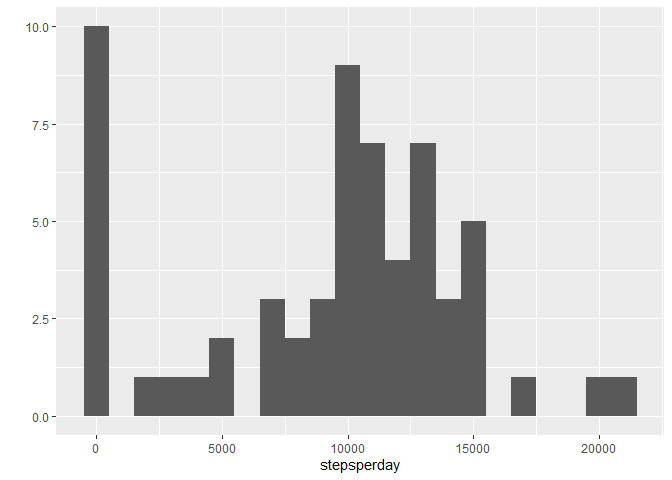
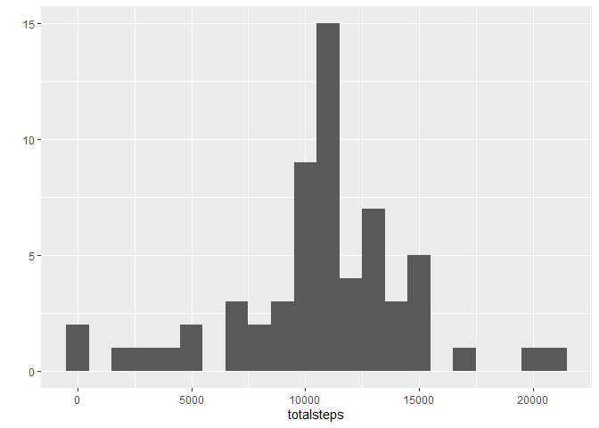

## Loading and preprocessing the data

```r
unzip(zipfile="activity.zip")
data <- read.csv("activity.csv")
```

## What is mean total number of steps taken per day?

```r
library(ggplot2)
stepsperday <- tapply(data$steps, data$date, FUN=sum, na.rm = TRUE)
qplot(stepsperday, binwidth=1000)
```

<!-- -->

Calculate and report the mean and median of the total number of steps taken per day

```r
mean(stepsperday, na.rm = TRUE)
```

```
## [1] 9354.23
```

```r
median(stepsperday, na.rm = TRUE)
```

```
## [1] 10395
```

## What is the average daily activity pattern?
Make a time series plot of the 5-minute interval (x-axis) and the average number of steps taken, averaged across all days (y-axis)

```r
averageactivity <- aggregate(x=list(steps=data$steps), by=list(interval=data$interval),
                      FUN=mean, na.rm=TRUE)
ggplot(data=averageactivity, aes(x=interval, y=steps)) +
    geom_line()
```

<!-- -->

Which 5-minute interval, on average across all the days in the dataset, contains the maximum number of steps?

```r
averageactivity[which.max(averageactivity$steps),]
```

```
##     interval    steps
## 104      835 206.1698
```

## Imputing missing values
There are many days/intervals where there are missing values (coded as `NA`). The presence of missing days may introduce bias into some calculations or summaries of the data.

Calculate and report the total number of missing values in the dataset (i.e. the total number of rows with NAs)

```r
missingvalues <- is.na(data$steps)
table(missingvalues)
```

```
## missingvalues
## FALSE  TRUE 
## 15264  2304
```

Devise a strategy for filling in all of the missing values in the dataset. Fill in the mean for that 5-minute interval. Create a new dataset that is equal to the original dataset but with the missing data filled in.


```r
meanvalue <- function(steps, interval) {
    filled <- NA
    ifelse (!is.na(steps), filled <- c(steps), filled <- (averageactivity[averageactivity$interval==interval, "steps"]))
    return(filled)
}
```

Create a new dataset that is equal to the original dataset but with the missing data filled in.


```r
completedata <- data
completedata$steps <- mapply(meanvalue, completedata$steps, completedata$interval)
```

Make a histogram of the total number of steps taken each day and Calculate and report the mean and median total number of steps taken per day. Do these values differ from the estimates from the first part of the assignment? What is the impact of imputing missing data on the estimates of the total daily number of steps?


```r
totalsteps <- tapply(completedata$steps, completedata$date, FUN=sum)
qplot(totalsteps, binwidth=1000)
```

<!-- -->

```r
mean(totalsteps)
```

```
## [1] 10766.19
```

```r
median(totalsteps)
```

```
## [1] 10766.19
```

The mean and median values are higher after imputing the missing (NA) values. 


## Are there differences in activity patterns between weekdays and weekends?
Create a new factor variable in the dataset with two levels – “weekday” and “weekend” indicating whether a given date is a weekday or weekend day.


```r
dayofweek <- function(date) {
    day <- weekdays(date)
   ifelse (day == "Saturday" | day == "Sunday", "Weekend", "Weekday")
}
completedata$date <- as.Date(completedata$date)
completedata$day <- sapply(completedata$date, FUN=dayofweek)
```

Make a panel plot containing a time series plot of the 5-minute interval (x-axis) and the average number of steps taken, averaged across all weekday days or weekend days (y-axis). 

```r
averageweekday <- aggregate(steps ~ interval + day, data=completedata, mean)
ggplot(averageweekday, aes(interval, steps)) + geom_line() + facet_grid(day ~ .)
```

<!-- -->
